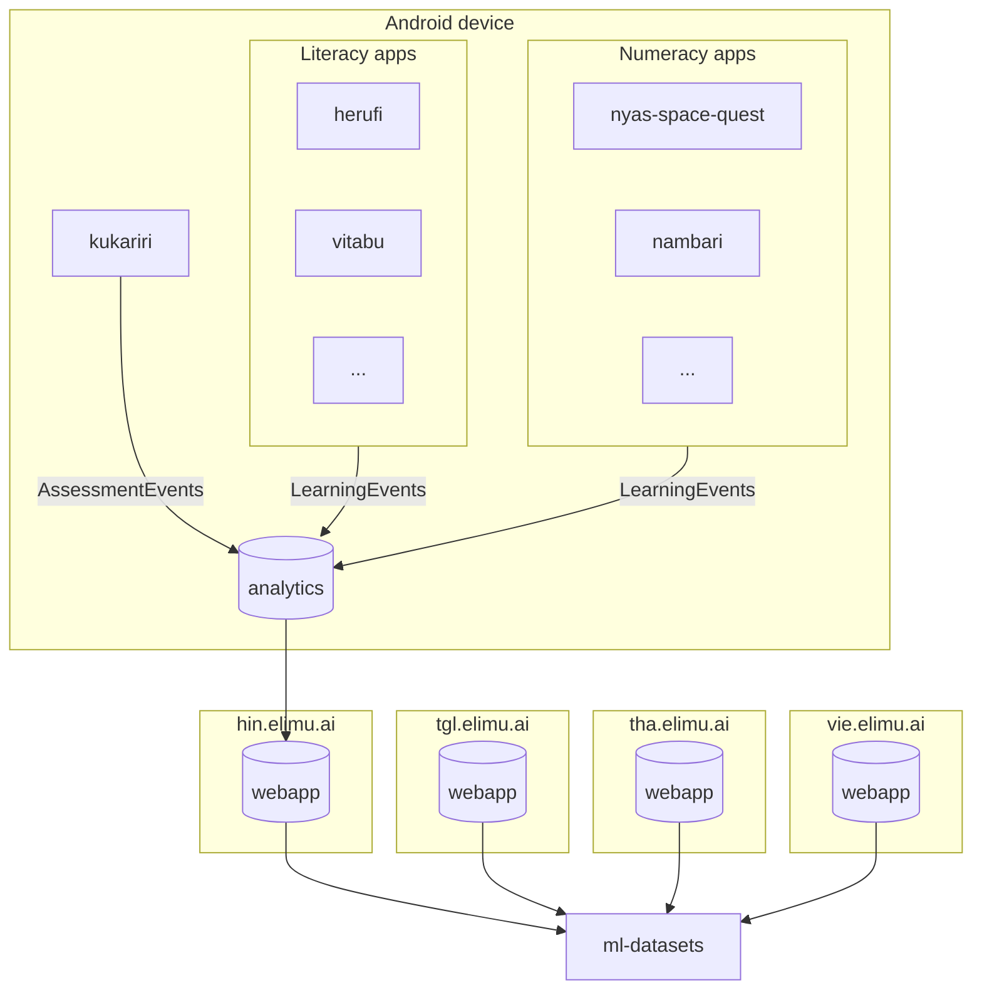

# ML Datasets 🫙

> Event datasets used for training machine learning models.

## Data Sources

For each supported language, learning events and assessment events are continuously uploaded from Android devices to the webapp database.

And those datasets are then downloaded to this repository in a [daily cron job](.github/workflows/download-datasets-daily.yml).



## Machine Learning Operations (MLOps)

When machine learning models are being trained with datasets collected from the elimu.ai Android apps, they should be fetching the data from this repository.

## Daily Updates

You can expect the datasets in this repository to be updated once per day.

> [!TIP]
> Since datasets in this repository are continuously updated, you should also design your machine learning code to continulously train new versions of your model (e.g. once per night).

## Code Usage

Prerequisites:

- Install [Python](https://www.python.org/)

### Dependencies

Install the Python dependencies:

```bash
pip install -r requirements.txt
```

### Run

Download datasets:

```bash
python download_datasets.py
```

---

<p align="center">
  
</p>
<p align="center">
  elimu.ai - Free open-source learning software for out-of-school children 🚀✨
</p>
<p align="center">
  <a href="https://elimu.ai">Website 🌐</a>
  &nbsp;•&nbsp;
  <a href="https://github.com/elimu-ai/wiki#readme">Wiki 📃</a>
  &nbsp;•&nbsp;
  <a href="https://github.com/orgs/elimu-ai/projects?query=is%3Aopen">Projects 👩🏽‍💻</a>
  &nbsp;•&nbsp;
  <a href="https://github.com/elimu-ai/wiki/milestones">Milestones 🎯</a>
  &nbsp;•&nbsp;
  <a href="https://github.com/elimu-ai/wiki#open-source-community">Community 👋🏽</a>
  &nbsp;•&nbsp;
  <a href="https://www.drips.network/app/drip-lists/41305178594442616889778610143373288091511468151140966646158126636698">Support 💜</a>
</p>
